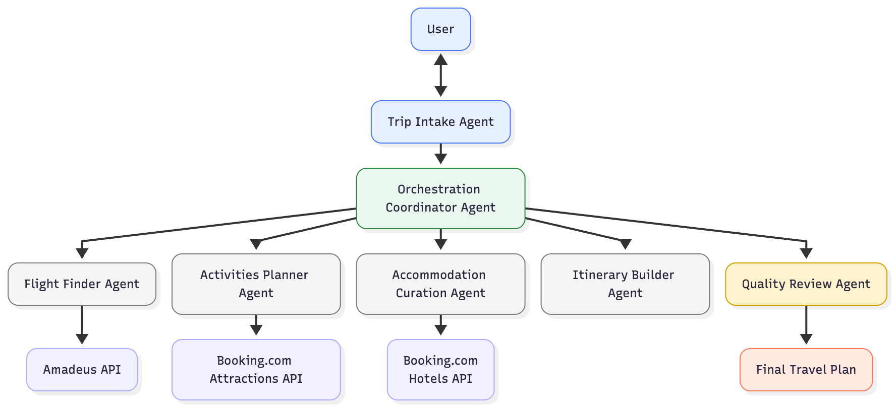

# Multi-Agentic Travel Planner 🌍✈️

A collaborative travel-planning system built around specialized agents that work together to design a complete, personalized trip itinerary. Each agent brings its own expertise, memory and reasoning, allowing the system to plan complex trips with ease.

## Features

- Multi-agent collaboration for end-to-end trip planning
- Custom tools and API integrations
- Independent memory and reasoning for each agent
- Dynamic itinerary generation by domain-expert agents
- Quality-checking agent to validate and refine all outputs

## Multi-Agentic Architecture



## Agents

- **TripIntakeAgent** - Collects essential trip details (destination, budget, duration, preferences) from the user and confirms all information.

- **TripOrchestrationAgent** - Orchestrates the workflow, delegates tasks in sequence, and tracks progress across agents.

- **FlightFinderAgent** - Searches for and recommends flights matching the user's travel dates and budget.

- **ActivitiesPlannerAgent** - Recommends attractions and activities tailored to the user's interests and trip duration.

- **AccommodationCurationAgent** - Finds and recommends 2-4 hotel options within budget with pricing, ratings, and locations.

- **ItineraryBuilderAgent** - Combines flights, accommodations, and activities into a detailed day-by-day itinerary with cost breakdown.

- **QualityReviewAgent** - Performs final quality checks on the itinerary for accuracy and consistency.

## Project Structure

```
Travel_planner/
├── BE/                          
│   ├── main.jac                 # Main server entry point
│   ├── agent_brain.jac          # Agent brain logic
│   ├── agent_core.jac           # Agent core implementation
│   ├── agent_memory.jac         # Agent memory management
│   └── tools.jac                # API integration tools
├── FE/                          
│   ├── streamlit_app.py         # Main Streamlit app
│   └── .streamlit/              # Streamlit configuration
├── requirements.txt             
├── .env.example                 
└── README.md                    
```

## Setup Instructions

1. Clone the repository and navigate to the directory:
```bash
git clone https://github.com/jaseci-labs/Agentic-AI.git
cd Agentic-AI/Travel_planner
```

2. Create and activate a virtual environment:
```bash
# On macOS/Linux
python3 -m venv venv
source venv/bin/activate

# On Windows
python -m venv venv
.\venv\Scripts\activate
```

3. Install the required dependencies:
```bash
pip install -r requirements.txt
```

## Environment Configuration

1. Copy the environment template:
```bash
cp .env.example .env
```

2. Set up your API keys in the `.env` file:
- `OPENAI_API_KEY`: Get from [OpenAI](https://platform.openai.com/api-keys)
- `AMADEUS_API_KEY` and `AMADEUS_API_SECRET`: Get from [Amadeus for Developers](https://developers.amadeus.com/)
- `RAPID_API_KEY`: Get from [RapidAPI](https://rapidapi.com/) - Used for [Booking.com API](https://rapidapi.com/tipsters/api/booking-com/playground/apiendpoint_ad1960c9-9d82-480b-b0d2-71f28064f8cd)

```
OPENAI_API_KEY=...
AMADEUS_API_KEY=...
AMADEUS_API_SECRET=...
RAPID_API_KEY=...
```

## Run the App

### 1. Run the Backend
Navigate to the BE directory and start the Jac server:
```bash
cd BE
jac serve main.jac
```

### 2. Run the Frontend
Navigate to the FE directory and run the Streamlit app:
```bash
cd FE
streamlit run streamlit.py
```

The application will be available at `http://localhost:8501`

## License

This project is licensed under the MIT License - see the LICENSE file for details.